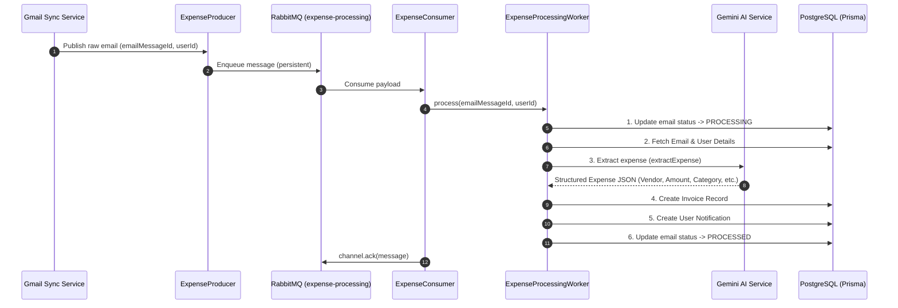

# SmartSpend - Worker Architecture & Background Processing

## 📌 Overview

The **SmartSpend Worker Architecture** is an asynchronous, event-driven background processing pipeline designed to handle email expense extraction efficiently. 

Instead of extracting expense details synchronously during email fetching (which would cause slow HTTP response times and potential timeouts), SmartSpend offloads processing to a background worker powered by **RabbitMQ** and **Gemini 2.5 Flash AI**.

---

## 🏗️ High-Level Architecture Diagram



---

## 🧩 Components Breakdown

The worker architecture consists of five core components located in `backend/src/`:

### 1. RabbitMQ Configuration
* **Location:** [`backend/src/config/rabbitmq.ts`](file:///c:/Users/omiit/Desktop/Projects/SmartSpend/backend/src/config/rabbitmq.ts)
* **Role:** Establishes the connection to the RabbitMQ broker (`RABBITMQ_URL`) and initializes the durable queue named `expense-processing`.

### 2. Expense Producer (`ExpenseProducer`)
* **Location:** [`backend/src/producers/expense.producer.ts`](file:///c:/Users/omiit/Desktop/Projects/SmartSpend/backend/src/producers/expense.producer.ts)
* **Role:** Publishes jobs onto the queue whenever new transaction emails are identified during Gmail sync.
* **Payload Structure:**
  ```json
  {
    "emailMessageId": "string",
    "userId": "string"
  }
  ```

### 3. Expense Consumer (`ExpenseConsumer`)
* **Location:** [`backend/src/consumers/expense.consumer.ts`](file:///c:/Users/omiit/Desktop/Projects/SmartSpend/backend/src/consumers/expense.consumer.ts)
* **Role:** Continuously listens for incoming jobs on the `expense-processing` queue.
* **Flow:** Parses the incoming JSON payload, passes parameters to the `ExpenseProcessingWorker`, and sends a message acknowledgment (`channel.ack`) upon completion or failure.

### 4. Expense Processing Worker (`ExpenseProcessingWorker`)
* **Location:** [`backend/src/workers/expense-processing.worker.ts`](file:///c:/Users/omiit/Desktop/Projects/SmartSpend/backend/src/workers/expense-processing.worker.ts)
* **Role:** Orchestrates the multi-step expense processing pipeline for a single email.

#### 🔄 Step-by-Step Processing Flow inside Worker:
1. **Status Update to `PROCESSING`:** Prevents race conditions or duplicate runs by updating `EmailMessage.processingStatus` to `PROCESSING`.
2. **Fetch Data:** Retrieves email subject, sender, and snippet alongside User information from PostgreSQL via Prisma repositories.
3. **AI Extraction:** Calls `extractExpense()` using Gemini AI to extract structured structured data (`vendor`, `amount`, `currency`, `category`, `confidence`, `expenseDate`).
4. **Invoice Creation:** Persists a new invoice record in the database using `InvoiceRepository.createInvoice()`.
5. **Notification Generation:** Records a user notification using `NotificationRepository.createNotification()`.
6. **Status Update to `PROCESSED`:** Marks `EmailMessage.processingStatus` as `PROCESSED`.
7. **Error Fallback:** If any error occurs during processing, catches the error and marks status as `FAILED`.

### 5. Gemini AI Extractor (`extractExpense`)
* **Location:** [`backend/src/ai/gemini/expense-extractor.ts`](file:///c:/Users/omiit/Desktop/Projects/SmartSpend/backend/src/ai/gemini/expense-extractor.ts)
* **Role:** Sends email content to `gemini-2.5-flash`, cleans response codeblocks, and validates structured output using Zod (`ExpenseSchema`).

---

## 🚦 Processing Status State Machine

Each email message undergoes strict status tracking:

```
[ PENDING ]  ---> (Producer enqueues job)
     |
     v
[ PROCESSING ] ---> (Worker starts processing)
     |
     +---> Success: [ PROCESSED ] (Invoice created + Notification sent)
     |
     +---> Failure: [ FAILED ]    (Error logged, status updated)
```

---

## 🛡️ Key Reliability Features

1. **Decoupled Architecture:** Heavy AI generation runs independently from the HTTP server thread, keeping user interaction fast and responsive.
2. **Message Persistence:** Queue is declared `durable: true` and messages published with `persistent: true`, ensuring jobs survive broker restarts.
3. **Poison Message Prevention:** The consumer acknowledges messages even if processing fails because the worker explicitly updates the database status to `FAILED`, preventing infinite queue retries.
4. **Data Validation:** Zod schema validation enforces strict type safety on Gemini's AI response before persisting to PostgreSQL.

---

## 📁 File Map

* 🔌 **RabbitMQ Config:** [`rabbitmq.ts`](file:///c:/Users/omiit/Desktop/Projects/SmartSpend/backend/src/config/rabbitmq.ts)
* 📤 **Producer:** [`expense.producer.ts`](file:///c:/Users/omiit/Desktop/Projects/SmartSpend/backend/src/producers/expense.producer.ts)
* 📥 **Consumer:** [`expense.consumer.ts`](file:///c:/Users/omiit/Desktop/Projects/SmartSpend/backend/src/consumers/expense.consumer.ts)
* ⚙️ **Worker:** [`expense-processing.worker.ts`](file:///c:/Users/omiit/Desktop/Projects/SmartSpend/backend/src/workers/expense-processing.worker.ts)
* 🤖 **Gemini Extractor:** [`expense-extractor.ts`](file:///c:/Users/omiit/Desktop/Projects/SmartSpend/backend/src/ai/gemini/expense-extractor.ts)
* 🗄️ **Invoice Repository:** [`invoice.repository.ts`](file:///c:/Users/omiit/Desktop/Projects/SmartSpend/backend/src/modules/invoice/invoice.repository.ts)
